# AvatarStatusDot Night Watch evidence

Audit PR: [facebook/astryx#6162](https://github.com/facebook/astryx/pull/6162)

- Rubric: 1.16
- Mode: Night Watch (N)
- Baseline: `9fdb3819f91b3642b46319f21f4d99f95bc14f16`
- Exact audit head: `d2b95a5a004a09485310a0018e9fb82a220f87a1`
- Every PNG has a sibling `*.sensors.json` receipt produced by `captureWithSensors()`.
- Receipts assert repository head, exact story, theme/mode, direction, viewport/media, semantic state, visible geometry, loaded fonts, zero running animations, and no page or Storybook errors.
- Local machine paths were removed from the published copies; sensor values and image bytes are unchanged.

## Before

The inherited Avatar story used one check glyph for all three custom-icon variants. The visual meaning therefore fell back to color even though the component docs explicitly require a different mark for each status.

| Light | Dark |
|---|---|
| 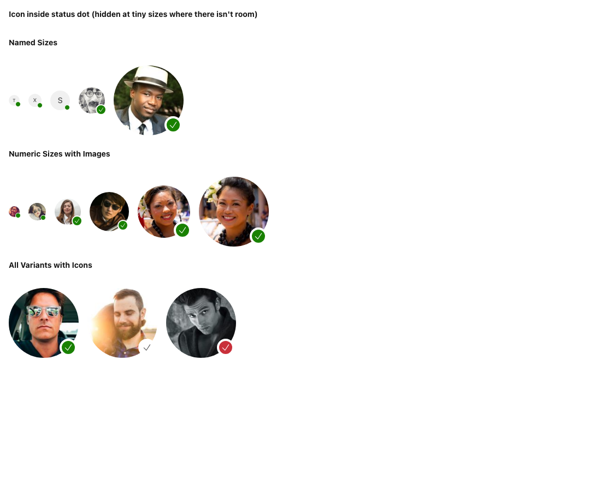 | 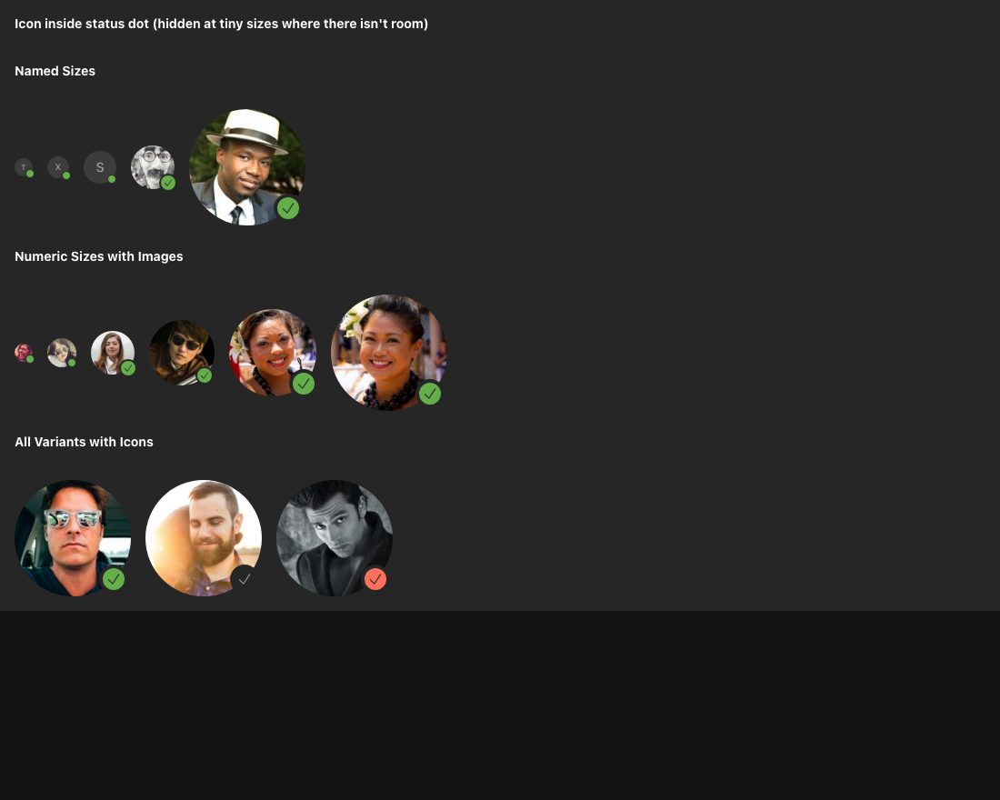 |

The baseline component matrix covered built-in variants and size tiers but lived under Avatar rather than a component-owned audit story.

| Light | Dark |
|---|---|
| 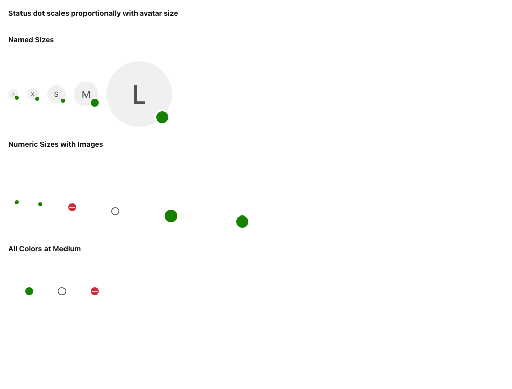 | 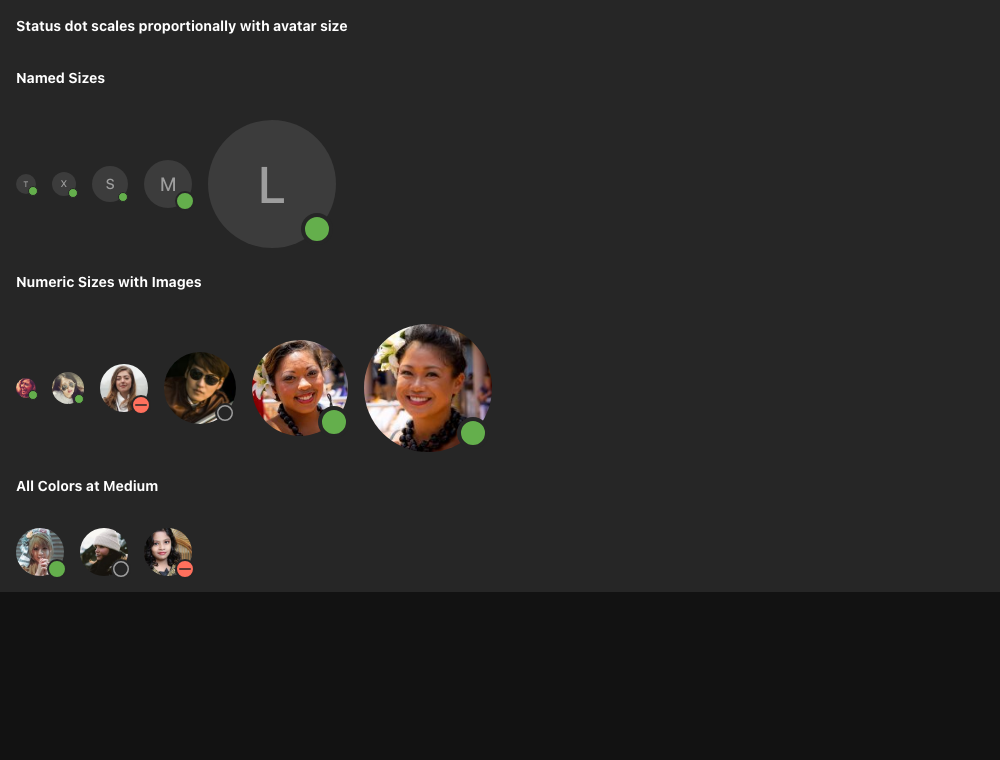 |

## After

The corrected audit head also captures the existing `StatusWithIcon` story against the original baseline with matching story, globals, mode, direction, viewport, media, and semantic-state sensors. The dedicated component story separately renders each built-in variant at the 10px, 20px, and 32px dot tiers.

| Neutral light | Neutral dark | Matcha light |
|---|---|---|
| 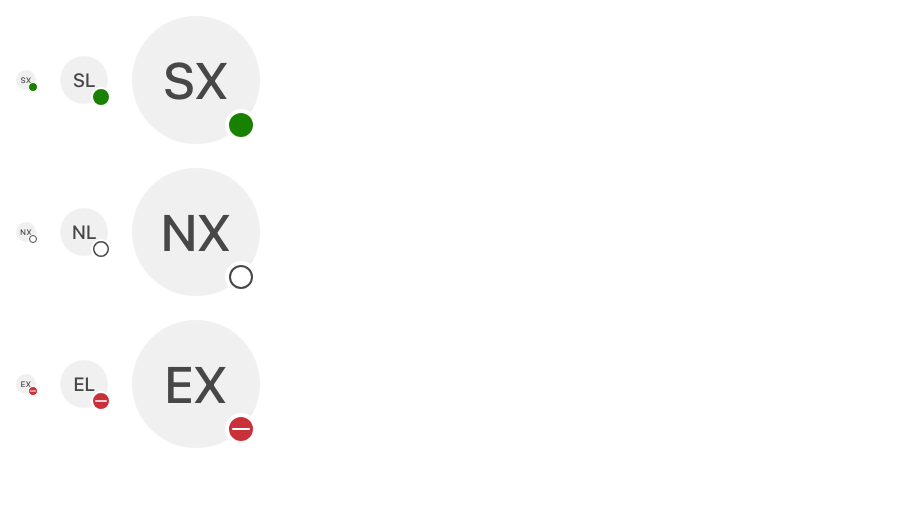 | 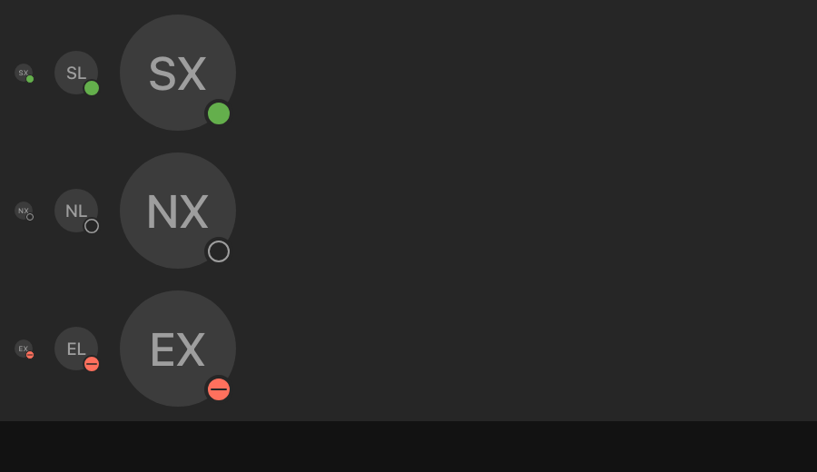 | 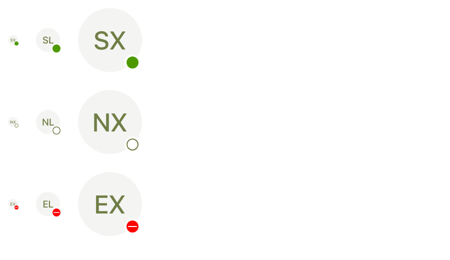 |

The exact same matrix was captured under Storybook's RTL global and passed the component-scoped RTL detector:

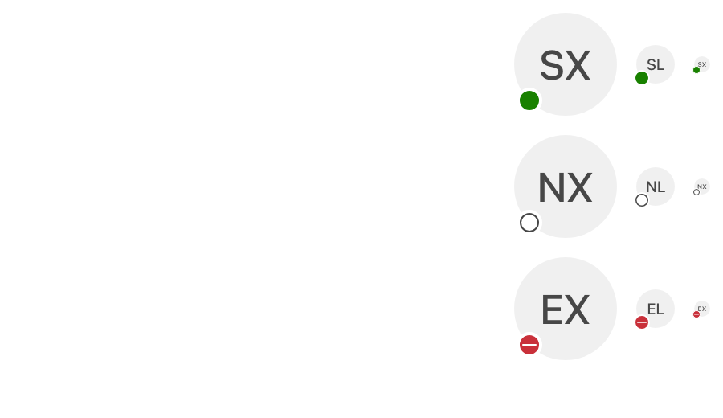

The existing custom-icon example now uses a check, clock, and x mark. These are the exact matched after frames for the baseline story and 1100×880 viewport:

| Light | Dark |
|---|---|
| 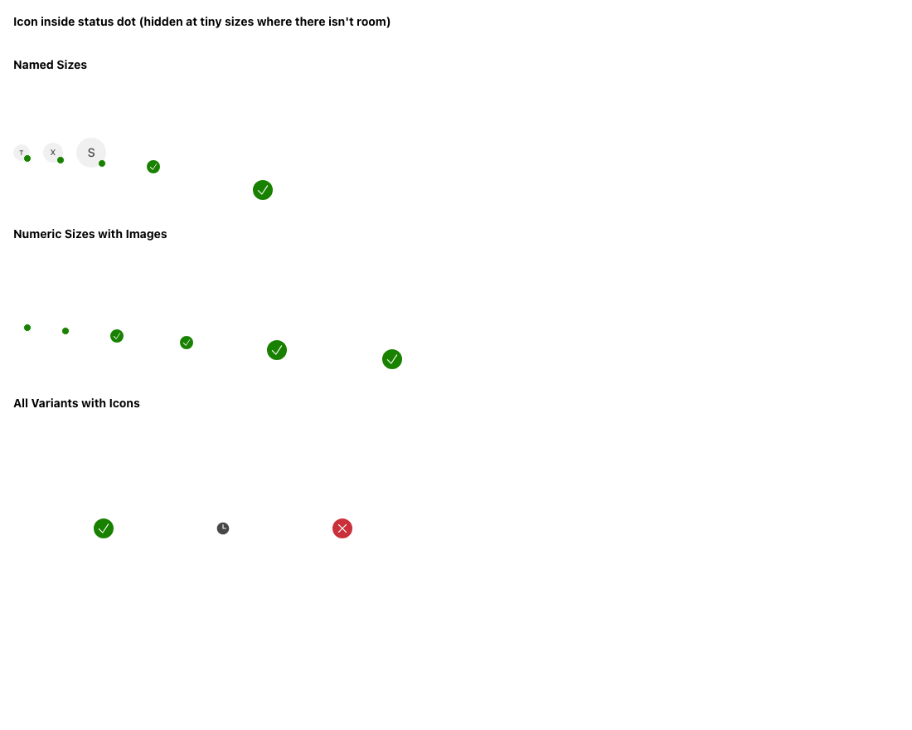 |  |

The dedicated component-owned story provides the same distinction as separate coverage:

| Light | Dark |
|---|---|
| 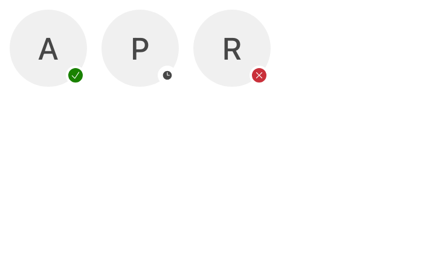 | 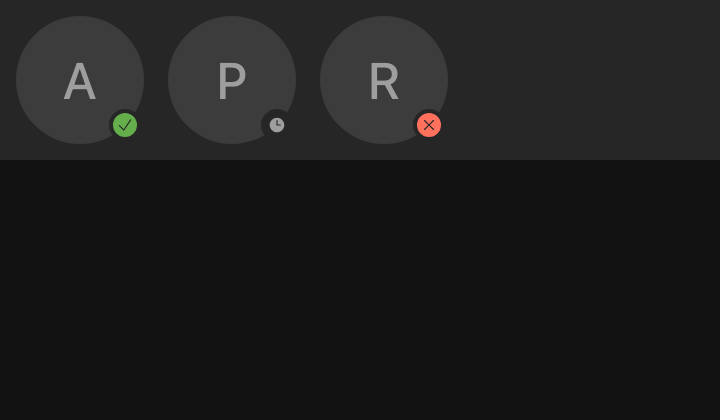 |

At 320px the three built-in states remain visible without horizontal overflow:

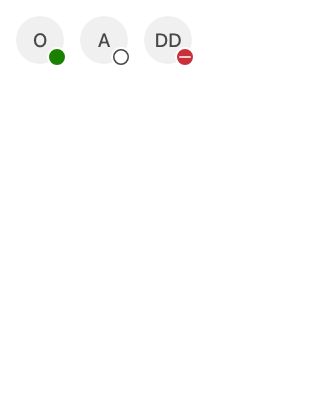

## Contrast measurements

Rendered medium-tier relationships from the exact consumer-loaded Storybook artifact:

| Theme / mode | Success fill ↔ separator | Neutral ring ↔ plate | Error minus ↔ plate |
|---|---:|---:|---:|
| Neutral light | 5.02:1 | 7.81:1 | 5.29:1 |
| Neutral dark | 5.61:1 | 5.65:1 | 5.57:1 |
| Matcha light | 3.58:1 | 4.41:1 | 4.06:1 |

All measured meaningful non-text relationships meet the WCAG 2.2 AA 3:1 threshold. The neutral plate-to-separator relationship is 1:1 by design and is not the meaningful mark; the ring ink against that plate is the measured relationship.

## State conformance

| State | Representation | Evidence | Verdict |
|---|---|---|---|
| `success` | compact solid status plate plus filled topology | semantic success token; distinct filled shape | pass |
| `neutral` | compact surface plate plus ring topology | secondary ink ring; ≥3:1 in measured themes | pass |
| `error` | compact solid status plate plus minus topology | semantic error token and contrasting minus | pass |
| custom icon | caller mark replaces built-in mark at medium/large tiers | distinct check/clock/x examples; icon path sensor | pass for shown examples; public same-icon seam remains a manual gap |
| small tier | built-in topology returns because custom icons are hidden | 10px rows in the variants matrix | pass |
