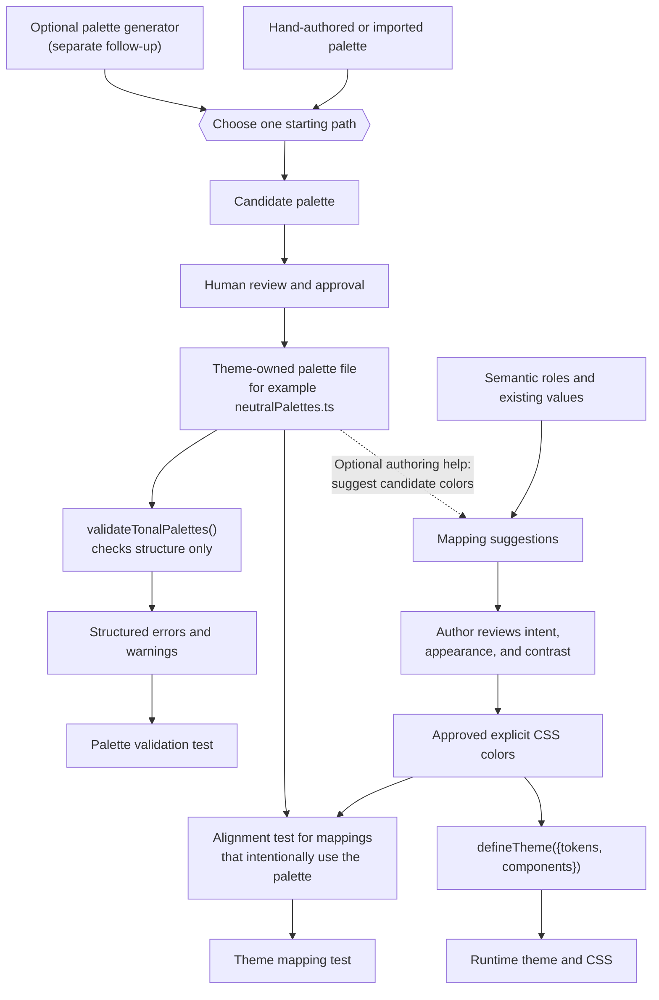

# Approved tonal palette authoring contract

## Intent

Give maintained themes a consistent, reviewable color reference without making
that reference part of the runtime theme contract.

A theme may keep an approved palette in a theme-owned source file. Authors and
tools can use it to select and audit explicit theme colors. `defineTheme()` still
receives the explicit values that control rendered output; it does not receive,
inherit, validate, publish, or resolve palette data.

Semantic tokens remain the primary interface for components and applications.
The palette is a starting point for color decisions and contrast testing, not a
claim that every component context already passes accessibility.

“Approved” means that the palette has been intentionally reviewed by its owning
theme. Structural validation does not grant design approval or certify contrast.

## Terminology

- A theme may own one **palette map**.
- The map contains named **families**, such as `neutral`, `red`, or `blue`.
- A family contains at least one mode-specific **ramp**: light, dark, or both.
- A ramp contains named numeric **stops**.
- An **explicit theme color** is the resolved CSS color stored in a token or
  component mapping.
- An **alignment check** compares an intentionally palette-backed theme color to
  the approved palette stop from which it was selected.

## Authoring flow

The palette file remains available for later authoring and audits. It does not
disappear after suggestions are generated. Mapping suggestions are optional and
must never rewrite a theme automatically. The author reviews each selected color
and stores the accepted CSS value explicitly in the theme.

## Non-goals

- Adding palettes to `DefineThemeInput` or `DefinedTheme`.
- Changing color expansion, inheritance, runtime CSS, or static theme builds.
- Requiring every theme to maintain a palette.
- Requiring every theme color to match a palette stop.
- Treating a stop as a semantic role or accessibility guarantee.
- Publishing palette files as runtime package artifacts in this change.
- Generating palettes or mapping suggestions in this change.
- Choosing the algorithm or production API for a future palette generator.

## Requirements

- **FR1 — Palette adoption is optional.** A maintained theme MAY keep a
  theme-owned palette file. A theme without one keeps its existing authoring,
  runtime, build, inheritance, and package behavior. Adopting a palette MUST NOT
  make it a required field of `defineTheme()`.
- **FR2 — The palette is authoring-only data.** Palette data MUST remain outside
  `DefineThemeInput`, `DefinedTheme`, runtime providers, generated CSS, and the
  generic `astryx theme build` output. It MAY be colocated with its theme or
  imported from another authoring source. This contract does not require one
  repository layout, but each maintained palette MUST have a clear owner.
- **FR3 — Declared ramps use a typed, explicit shape.** A palette map MUST contain
  at least one named family. Each family MUST declare a complete light ramp, a
  complete dark ramp, or both. Missing modes MUST NOT be inferred. A theme such
  as Gothic MAY declare only dark ramps, while a theme such as Stone MAY maintain
  only one family. A shared ramp MUST be assigned to both modes explicitly.
  Declared ramps use the approved stops from 0 through 100 in increments of five,
  opaque six-digit hex values, and nondecreasing relative luminance. Optional
  hue, chroma, semantic, and description fields are metadata only.
- **FR4 — Validation is explicit and non-mutating.**
  `validateTonalPalettes()` MUST inspect palette data without defining,
  normalizing, generating, or returning a replacement palette. It MUST return a
  structured result containing `valid`, `errors`, and `warnings`. Errors MUST
  include a path and message. The validator MUST NOT run from `defineTheme()`, a
  runtime provider, or the generic theme build.
- **FR5 — Theme values remain explicit.** Authors and tools MAY use a palette to
  suggest or choose a color, but the accepted CSS color MUST be stored explicitly
  in the theme token or component mapping. Palette edits and theme remaps remain
  separate reviewed changes. Renaming, removing, or changing a palette stop MUST
  NOT silently alter rendered output.
- **FR6 — Validation and alignment are separate checks.** An adopting theme MUST
  test that its palette has no structural errors. It SHOULD separately test the
  theme mappings intentionally selected from palette stops. The alignment test
  MUST NOT imply that every direct theme color is a violation. Alpha overlays,
  brand colors, composited colors, and contrast-specific adjustments MAY remain
  explicit intentional deviations.
- **FR7 — Accessibility remains contextual.** A structurally valid palette or an
  aligned mapping does not prove that a foreground/background pair, interaction
  state, or component passes WCAG. The owning theme MUST test contrast in the
  actual component contexts it intends to support.
- **FR8 — Generation is a separate capability.** A future generator or CLI MAY
  create candidate palette files or mapping suggestions. That work MUST have its
  own accepted contract and review. Generated output remains a candidate until a
  theme author reviews and adopts it; merely adding a palette MUST NOT trigger
  automatic nearest-color replacement.

## Handling existing and intentional differences

This contract applies only when a theme chooses to adopt the palette shape. It
does not retroactively reject unrelated themes or their existing color systems.

The validator distinguishes the declared contract from theme usage:

- Invalid palette containers, malformed colors, unknown fields, missing required
  stops, or a family with neither mode are structural errors.
- Light-only, dark-only, dual-mode, single-family, and multi-family palettes are
  supported shapes rather than exceptions.
- Colors outside the palette are not validator errors because the validator does
  not inspect theme tokens or components.
- An intentional mapping difference is handled in the owning theme's alignment
  test: update the theme, retain and document the explicit deviation, or revert
  the palette change.

Future repository tooling may add warnings after maintained palettes are audited
for real patterns. It must not convert an intentional existing pattern into a
hard failure without first adding that pattern to the contract or documenting a
narrow exception.

## Current-state impact

Current `main` stores explicit theme colors and has no palette field in the
normalized theme contract. This proposal preserves that behavior.

Neutral becomes the first adopter. Its palette moves to a dedicated
`neutralPalettes.ts` authoring file, while `neutralTheme.ts` continues to contain
the explicit values used at runtime. Neutral's tests validate the palette and
compare representative approved mappings. This provides a stable baseline for
subsequent component-level contrast work without claiming that the remap itself
completes that work.

The existing sandbox generator remains useful design evidence. A production
generator is intentionally deferred to a separate proposal informed by the
sandbox and the discussion in PR #5800.

## Verification

- `packages/core/src/theme/palettes.test.ts` verifies the palette schema,
  mode-specific shapes, structured results, and invalid inputs.
- `packages/core/src/theme/defineTheme.test.ts` continues to verify the runtime
  theme contract without palette fields or behavior.
- `packages/themes/neutral/src/neutralTheme.test.ts` validates Neutral's palette
  and separately verifies representative explicit mappings.
- `scripts/check-theme-template.test.mjs` prevents the shipped Neutral palette
  template from drifting from the theme-owned source.
- Core and Neutral type checks verify that palette authoring types do not widen
  the runtime theme input or output.
- Existing CLI build tests verify that generic theme build behavior is unchanged.

## Decision log

### DEC-1 — Palettes guide consistency without enforcing it

**Reference:** `spec:AST-018/DEC-1`

**Decider:** `rubyycheung`, `2026-09-02`

Themes may use a palette to establish consistent color expression, but adoption
and usage remain optional. Semantic tokens are preferred, while intentional
direct colors remain valid.

Rejected: requiring every theme or every color to use the palette. That would
turn authoring guidance into runtime policy and misrepresent legitimate
overlays, brand colors, and contrast-specific values.

### DEC-2 — Palette data stays outside the runtime theme contract

**Reference:** `spec:AST-018/DEC-2`

**Decider:** `rubyycheung`, `2026-09-03`

Palette files are theme-owned authoring references. `defineTheme()` does not
accept, validate, retain, inherit, or publish them. This follows
`architecture:theme-authoring-contract`: validation-only data does not enter the
normalized runtime theme.

Rejected: a `palettes` field on `DefineThemeInput` or `DefinedTheme`. It adds
runtime compatibility cost without constructing a runtime value.

### DEC-3 — Validation reports; it does not define

**Reference:** `spec:AST-018/DEC-3`

**Decider:** `rubyycheung`, `2026-09-03`

The helper is named `validateTonalPalettes()` and returns structured errors and
warnings. It does not return the unchanged palette as though it constructed a
new value. Theme-package tests decide how validation results affect CI.

Rejected: `defineTonalPalettes()`. Under `spec:AST-002/FR17` and DEC-7, a
`define*` helper must construct or normalize a durable supported value.

### DEC-4 — Theme mappings store reviewed CSS values

**Reference:** `spec:AST-018/DEC-4`

**Decider:** `rubyycheung`, `2026-09-03`

Palette-based mappings are authoring decisions. Once approved, the selected CSS
values are stored directly in the theme. A separate alignment test makes drift
visible without coupling runtime rendering to palette names or stop counts.

Rejected: live palette references and automatic nearest-color replacement.
Either could silently recolor a theme when a palette changes.

### DEC-5 — Neutral's remap is a contrast-testing baseline

**Reference:** `spec:AST-018/DEC-5`

**Decider:** `rubyycheung`, `2026-09-02`

Neutral's approved palette and explicit remap provide an anchor for future color
decisions and component contrast tests. Approval does not claim that every
existing component, mode, or interaction state already passes accessibility.

Rejected: making complete component-level conformance a prerequisite for the
palette. The palette is the baseline used to find and fix those contextual
issues.

### DEC-6 — Supported modes are explicit

**Reference:** `spec:AST-018/DEC-6`

**Decider:** `rubyycheung`, `2026-09-03`

A family declares light, dark, or both ramps. Missing modes are not inferred.
This supports dark-only themes such as Gothic and single-family themes such as
Stone without pretending they have a different mode or inventory.

### DEC-7 — Palette generation is follow-up work

**Reference:** `spec:AST-018/DEC-7`

**Decider:** `rubyycheung`, `2026-09-03`

This proposal validates adopted palette files. A production generator and any
CLI commands for creation or mapping suggestions require a separate proposal.
The existing sandbox prototype and PR #5800 are inputs to that future design,
not runtime dependencies or accepted APIs in this contract.

## Open questions

None.
