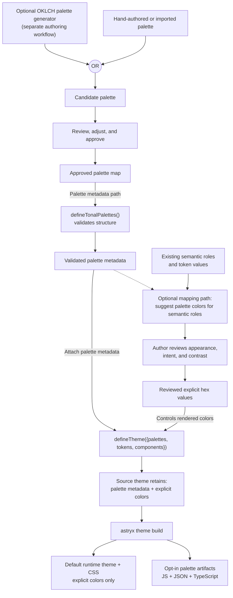

# Approved tonal palette metadata system spec

## Intent

Give maintained themes a typed, validated reference inventory of approved
numbered color stops. Theme authors and tooling can use that inventory to select
and verify explicit theme colors without turning every stop into a portable
semantic token or adding the palette to the default runtime theme module.

Semantic tokens remain the primary interface for components and applications.
Theme definitions continue to store their selected color values explicitly.
Palette stops provide a consistent reference for those decisions, visualizations,
and other cases where the portable vocabulary does not express the required
color; they are not live dependencies that automatically rewrite theme output.

“Approved” means that a palette is intentionally maintained and reviewed by its
owning theme. `defineTonalPalettes()` validates the data contract; it does not
grant design approval or certify accessibility.

The author supplies this palette map to `defineTheme({palettes})`. It MAY be
declared inline or imported from a colocated theme-owned module such as
`neutralPalettes.ts`; this contract does not require one source-file layout.
Generating the initial ramps from seeds or anchors is a separate authoring
workflow. Once the map is attached, the theme build generates its published
palette artifact set automatically.

## Terminology

This record uses the vocabulary already established by the Neutral remap:

- A theme has one **palette map**.
- The map contains one or more named **families**, such as `neutral` or `red`.
- A family contains at least one mode-specific **ramp**: light, dark, or both.
- A ramp contains the complete set of numbered **stops**.
- A palette-bearing build emits one **palette artifact set** for the theme in
  JavaScript, JSON, and TypeScript declaration formats.

## Authoring and build flow

The palette metadata path is used only when a theme chooses to adopt a palette.
The dashed mapping path represents optional authoring assistance, not automatic
`defineTheme()` behavior or a required part of this implementation. The approved
palette remains attached to the source theme whether or not mapping suggestions
are used.

## Non-goals

- Enforcing that every theme color comes from a declared palette.
- Rejecting direct CSS colors or requiring an exception mechanism before a theme
  can use one.
- Treating a palette stop as a semantic role or accessibility guarantee.
- Exposing numbered palette stops as portable Core tokens for component or
  application code.
- Generating semantic tokens automatically from hue, chroma, or stop numbers.
- Generating initial palette ramps from seeds or anchors.
- Replacing explicit theme color values with live palette references.
- Approving any particular theme's palette values, mappings, or visual result.
- Adding repository-wide palette linting in the initial contract implementation.

## Requirements

- **FR1 — Palette metadata is optional and additive.** The `defineTheme()`
  configuration MAY accept an optional named palette map. A theme that omits it
  retains its existing runtime, build, inheritance, and package behavior.
  Authors MUST supply adopted palette values explicitly through the `palettes`
  field. The map MAY be declared inline or imported from a theme-owned module;
  this contract MUST NOT require a particular source-file layout.
  `defineTheme()` MUST validate and retain declared palette metadata for source
  authoring. It MUST NOT generate a palette, find nearest stops, change `color`
  expansion, rewrite token values, or otherwise alter CSS merely because a
  palette is declared.
- **FR2 — Declared ramps are complete and validated.** Every declared family
  MUST provide at least one complete ramp for the approved numbered stop set:
  light, dark, or both. A theme such as Gothic MAY declare only dark ramps, and
  there is no required family set: a theme such as Stone MAY declare only one
  family. A family supporting both modes MUST declare both ramps. If both modes
  intentionally share one ramp, the author MUST assign that ramp to both fields;
  a missing mode MUST NOT silently reuse the other. When `palettes` is present,
  it MUST contain at least one family; a theme with no palette omits the field.
  Values MUST be opaque six-digit hex colors ordered from darker to lighter by
  relative luminance. Unknown family and ramp fields MUST be rejected. Hue,
  chroma, semantic labels, and descriptions are optional metadata rather than
  generators.
- **FR3 — Semantic tokens remain first and mappings remain explicit.** Components
  and applications SHOULD use portable semantic tokens. Maintained theme source
  MAY select a color by consulting an exact palette stop, but the resulting token
  or theme-owned component mapping MUST retain its explicit resolved color value
  rather than a live palette lookup. The existence of a palette MUST NOT make
  numbered stops part of the portable token contract.
- **FR4 — Palette usage is not hard-enforced.** Existing token and component
  value contracts MUST continue to accept direct CSS colors. Intentional
  deviations MAY be used for alpha overlays, composited colors, externally
  defined brand colors, contrast-specific adjustments, or other cases where no
  approved opaque stop satisfies the requirement. A palette validator MUST NOT
  reinterpret or reject those values.
- **FR5 — Theme adoption owns values and exceptions.** Each adopting theme's
  colocated theme spec owns its palette inventory, selected token and component
  mappings, intentional deviations, and visual approval. The remap establishes a
  stable base for subsequent contrast testing; it does not claim that every
  component context already passes accessibility. Sharing a palette stop does not
  prove that every foreground/background or interaction-state pairing meets its
  required contrast. Changing palette metadata MUST NOT silently change an
  existing rendered theme value; remapping remains an explicit reviewed edit.
- **FR6 — Source-theme extension is deterministic by family.** A child extending
  a source theme MUST inherit its base theme's resolved palette families and MAY
  replace a family by restating its exact family name. Family replacement is
  shallow; stops from two versions of one family MUST NOT be combined into an
  unreviewed ramp. Choosing a source theme as an authoring base includes accepting
  responsibility for its inherited palette decisions. Family names are local to
  their owning theme; independently imported `neutralPalettes.red` and
  `stonePalettes.red` do not share a global namespace. Tooling MUST NOT combine
  unrelated palette artifact sets into an unqualified global family map.
- **FR7 — Runtime and artifact boundaries are explicit.** Source themes retain
  resolved palette metadata for authoring and source-theme extension. The default
  built runtime module MUST omit it. A palette-bearing static build MUST emit
  exactly one logical palette artifact set containing the same resolved metadata
  in JavaScript, JSON, and TypeScript declaration formats. The formats are not
  independent palettes, and color families MUST NOT be emitted as separate
  artifact sets.
- **FR8 — Optional artifacts have a complete lifecycle.** Build and `--check`
  behavior MUST create, compare, report, and remove every file in the palette
  artifact set as the source adds, changes, or removes palette metadata.
  Palette-free themes MUST remain buildable when the installed Core version
  predates this optional contract; a palette-bearing theme MUST fail clearly
  when that Core support is unavailable.
- **FR9 — Published palette removal is compatibility work.** Local and
  unpublished builds MAY remove obsolete palette artifacts automatically. Once a
  published package exposes a `/palette` subpath, removing its palette MUST also
  remove the package export through an explicitly reviewed breaking Changeset and
  migration note. A published export MUST NOT remain pointed at a deleted
  palette artifact.

### Platform support

- Supported feature/engine floor: every platform that consumes the existing
  theme authoring object or the CLI's generated theme artifacts.
- Unsupported behavior: a consumer MUST NOT infer semantic meaning or accessible
  pairings from stop numbers alone.
- Browser evidence: palette structure and artifacts are nonvisual; each adopting
  theme supplies real-browser evidence for the palette and baseline mappings it
  proposes. Component-context contrast evidence may be added through subsequent
  accessibility audits and targeted mapping changes.

## Current-state impact

Current `main` has semantic color tokens and theme-local values but no typed
inventory for complete approved ramps. Theme authors either repeat literal
colors or maintain palette knowledge outside the theme contract.

This proposal adds optional `palettes` metadata to the normalized source theme,
validates complete ramps, inherits families, and emits an opt-in palette artifact
set. It does not change the meaning or accepted values of `tokens`, `localTokens`,
or component overrides. Neutral is the first proposed adopter; its exact ramps,
mappings, deviations, and visual approval remain owned by `theme:neutral`. The
Neutral remap creates the consistent base needed to run systematic contrast
tests; its mappings retain explicit resolved color values and do not change when
palette metadata changes. The remap does not claim that all existing component
combinations pass.

The existing post-build `scripts/verify-exports.mjs` check fails when a published
package export points to a missing or unloadable palette artifact. A focused
`check:theme-palettes` repository check remains planned as follow-up tooling for
palette-specific authoring feedback: identifying which explicit theme colors
match palette families and stops, warning about unusually large palette output or
values that no longer match an intended stop, and preserving intentional
deviations allowed by FR4. Consumer guidance should say to use an approved stop
when one satisfies the requirement rather than implying that direct colors are
always prohibited.

## Verification

| Contract | Verification                                                           | Representative states                                                                                    | Mutation or failure expectation                                                                                                             |
| -------- | ---------------------------------------------------------------------- | -------------------------------------------------------------------------------------------------------- | ------------------------------------------------------------------------------------------------------------------------------------------- |
| FR1–FR2  | `packages/core/src/theme/palettes.test.ts` and `defineTheme.test.ts`   | omitted metadata; complete and incomplete ramps; invalid colors, order, and fields                       | An omitted palette changes a theme, or malformed metadata is accepted.                                                                      |
| FR3–FR5  | Neutral source, theme spec, token tests, and rendered palette evidence | explicit semantic mapping; matching palette value; intentional deviation; light/dark baseline mapping    | A palette edit silently changes theme output, a justified direct value is rejected, or the remap is treated as accessibility certification. |
| FR6      | Core theme-extension tests                                             | inherited families; exact family replacement; light-only, dark-only, and dual-mode families              | A child loses unrelated families, accidentally merges partial ramps, or invents an undeclared mode.                                          |
| FR7–FR8  | CLI palette build and older-Core compatibility tests                   | source and built bases; JS/JSON/declaration outputs; add/change/remove; `--check`; palette-free old Core | Runtime output gains unused metadata, palette artifacts drift or remain stale, or an unrelated older-Core build fails.                      |
| FR9      | `scripts/verify-exports.mjs`, package build, and Changeset review      | unpublished cleanup; published `/palette` retention and removal                                          | An exported palette artifact disappears without compatibility treatment, or an export points to a deleted file.                             |

## Decision log

### DEC-1 — Palette adoption guides consistency without requiring it

**Reference:** `spec:AST-018/DEC-1`

**Decider:** `rubyycheung`, `2026-09-02`

The palette helps theme authors create consistent color expression. Declaring a
palette and selecting its stops remain optional; themes that do not need the
contract continue to work unchanged. Semantic tokens remain the preferred
interface, and intentional theme-owned deviations remain valid.

Rejected: requiring every theme to declare a palette or rejecting every direct
color that does not match a palette stop. Those approaches would turn guidance
into enforcement and force legitimate overlays, brand colors, and
contrast-specific values into misleading palette entries.

### DEC-2 — Emit one palette artifact set in JavaScript, JSON, and declarations

**Reference:** `spec:AST-018/DEC-2`

**Decider:** `rubyycheung`, `2026-09-02`

Each palette-bearing theme emits one logical artifact set. JavaScript supports
theme-authoring and tooling imports, JSON provides a data-only format for agents
and non-JavaScript tooling, and a TypeScript declaration accompanies the
JavaScript export. These are representations of the same resolved palette, not
independent palette contracts or application styling APIs.

Rejected: emitting separate artifacts for individual color families or choosing
only one consumption format. Per-family artifacts would fragment ownership and
versioning; omitting JSON or JavaScript would unnecessarily restrict consumers.

### DEC-3 — Neutral's remap is a contrast-testing baseline

**Reference:** `spec:AST-018/DEC-3`

**Decider:** `rubyycheung`, `2026-09-02`

Neutral's palette remap establishes a consistent, named color foundation from
which component contrast can be measured and improved. Approving the remap does
not assert that every existing component, mode, or interaction state already
passes accessibility requirements. Component-context findings remain separately
testable and fixable without invalidating the palette contract.

The exact Neutral palette values and resolved baseline colors in this change are
approved as the anchor for those subsequent decisions. The theme retains those
colors explicitly, and its tests verify representative values against the
palette without making the palette their runtime or authoring dependency.

Rejected: making complete component-level contrast conformance a prerequisite for
defining the palette. That would confuse the measurement baseline with the
follow-up work the baseline is intended to enable.

### DEC-4 — Source inheritance includes palette responsibility

**Reference:** `spec:AST-018/DEC-4`

**Decider:** `rubyycheung`, `2026-09-02`

Extending a source theme means selecting it as a complete authoring foundation,
including its palette metadata. The derived-theme author assumes responsibility
for inherited and replaced palette reference data. That metadata does not rewrite
the child's inherited or explicit theme values. Extending the built theme receives
the finished runtime styling without palette metadata; authors who need both may
import the built theme and its `/palette` artifact explicitly.

No palette-removal operation is added. Authors who do not want inherited palette
metadata use the built theme as their base instead.

Rejected: adding `palettes: null`, per-family deletion markers, or palette
metadata to every built runtime theme. Those options add merge complexity or
runtime weight when the existing source, built, and `/palette` entry points
already express the intended choice.

### DEC-5 — An explicitly empty palette map is invalid

**Reference:** `spec:AST-018/DEC-5`

**Decider:** `rubyycheung`, `2026-09-02`

When `palettes` is present, it contains at least one complete named family. A
theme with no palette omits the field. A real palette may be published before it
is reflected in theme values because usage is optional; future tooling may report
that as informational rather than rejecting it.

Rejected: treating `palettes: {}` as a placeholder or as equivalent to omission.
An empty map communicates no palette intent and can conceal accidental removal of
every family.

### DEC-6 — Theme mappings retain explicit resolved colors

**Reference:** `spec:AST-018/DEC-6`

**Decider:** `rubyycheung`, `2026-09-02`

The palette is a reference and verification tool, not a live dependency for
rendered theme values. Theme token and component mappings retain their selected
resolved colors explicitly. Agents and tooling may identify the matching family
and stop, while palette changes and theme remaps remain separate reviewable
decisions.

Rejected: resolving maintained theme mappings through live palette lookups. That
would allow a palette edit or family rename to silently recolor or break the theme
and would couple runtime behavior to authoring metadata that is intentionally
optional.

### DEC-7 — Existing package verification owns export parity

**Reference:** `spec:AST-018/DEC-7`

**Decider:** `rubyycheung`, `2026-09-02`

The theme builder owns creating and removing palette artifacts. The existing
post-build `scripts/verify-exports.mjs` check owns confirming that every published
package export points to a file that exists and that runtime export targets load.
Removing a released `/palette` export remains explicit compatibility work with a
breaking Changeset and migration note.

The planned palette-specific checker may add authoring guidance and drift reports,
but package-export safety does not wait for that follow-up.

Rejected: coupling the generic theme builder to package layout or adding a
Neutral-only export test that duplicates the repository-wide verifier.

### DEC-8 — Palette modes are declared explicitly

**Reference:** `spec:AST-018/DEC-8`

**Decider:** `rubyycheung`, `2026-09-03`

A palette family declares the modes its owning theme supports: light, dark, or
both. At least one complete ramp is required. Missing modes are not inferred,
which allows dark-only themes such as Gothic without pretending that their ramp
is a light palette. A theme intentionally using one ramp in both modes assigns
that ramp to both fields explicitly.

Rejected: requiring every family to provide a light ramp or treating an omitted
dark ramp as an instruction to reuse the light ramp. Both approaches hide the
theme's actual mode support.

## Open questions

None.
