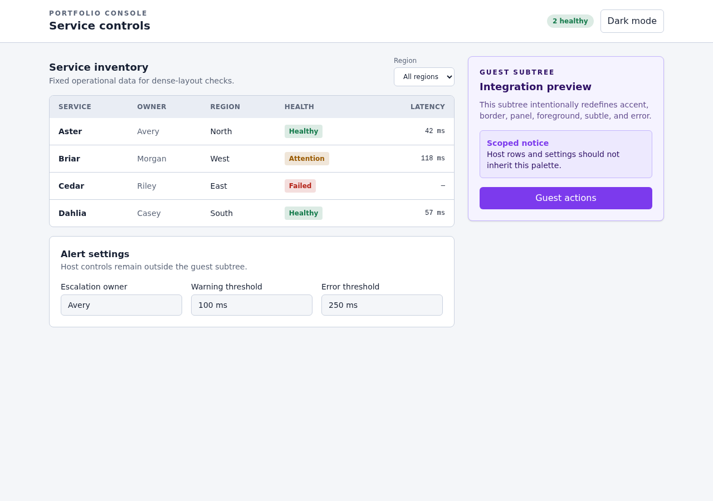
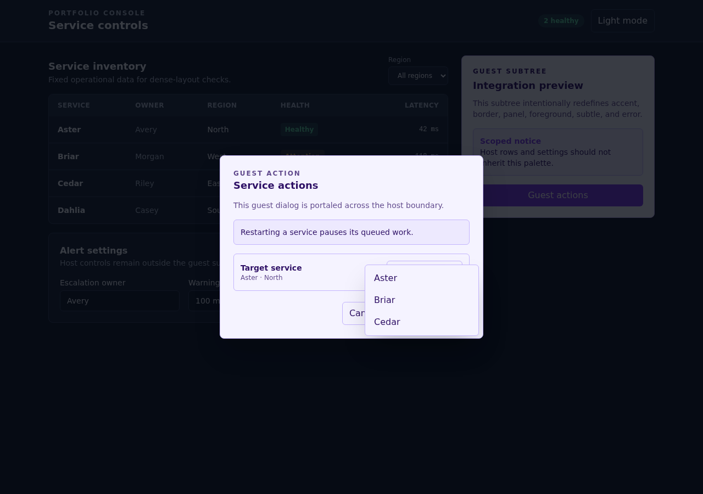

# Canonical consumer fixtures

These deterministic apps model three common Tailwind v4 integration shapes. The screenshots document their production builds; they are not golden tests.

| Plain Tailwind control                                                                                                                | Established shadcn-style app                                                                                                                                  | Scoped enterprise-style app                                                                                                                            |
| ------------------------------------------------------------------------------------------------------------------------------------- | ------------------------------------------------------------------------------------------------------------------------------------------------------------- | ------------------------------------------------------------------------------------------------------------------------------------------------------ |
|                                                       |                                                     |                                                              |
| A minimal Tailwind app that catches setup steps that assume an existing semantic theme or change baseline utility and reset behavior. | An app-owned semantic token system that catches token collisions, mode mismatches, and regressions in cards, forms, statuses, tables, and top-layer surfaces. | An explicit color-mode contract with host UI around a guest subtree that catches app-token leakage, boundary failures, and top-layer host-token drift. |

## Dark and interaction states

| Established shadcn-style app                                                                                                                | Scoped enterprise-style app                                                                                                                        |
| ------------------------------------------------------------------------------------------------------------------------------------------- | -------------------------------------------------------------------------------------------------------------------------------------------------- |
|  |  |
| The portal dialog keeps its independently portaled help tooltip and approval-route menu visibly above the backdrop.                         | The guest-scoped dialog and menu cross the host boundary while retaining guest tokens and their intended layer order.                              |

## Refreshing screenshots

Render changed fixture screenshots from production builds at 1280 × 900, then refresh the fixture manifest:

```bash
pnpm -F @astryxdesign/vibe-tests fixtures:screenshots
pnpm -F @astryxdesign/vibe-tests fixtures:refresh -- enterprise-scoped-synthetic
pnpm -F @astryxdesign/vibe-tests fixtures:verify
```

The gallery is capped at 250 KiB per PNG and 300 KiB total.
