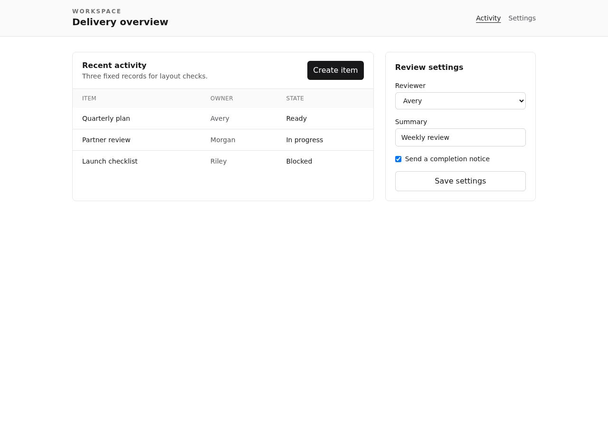
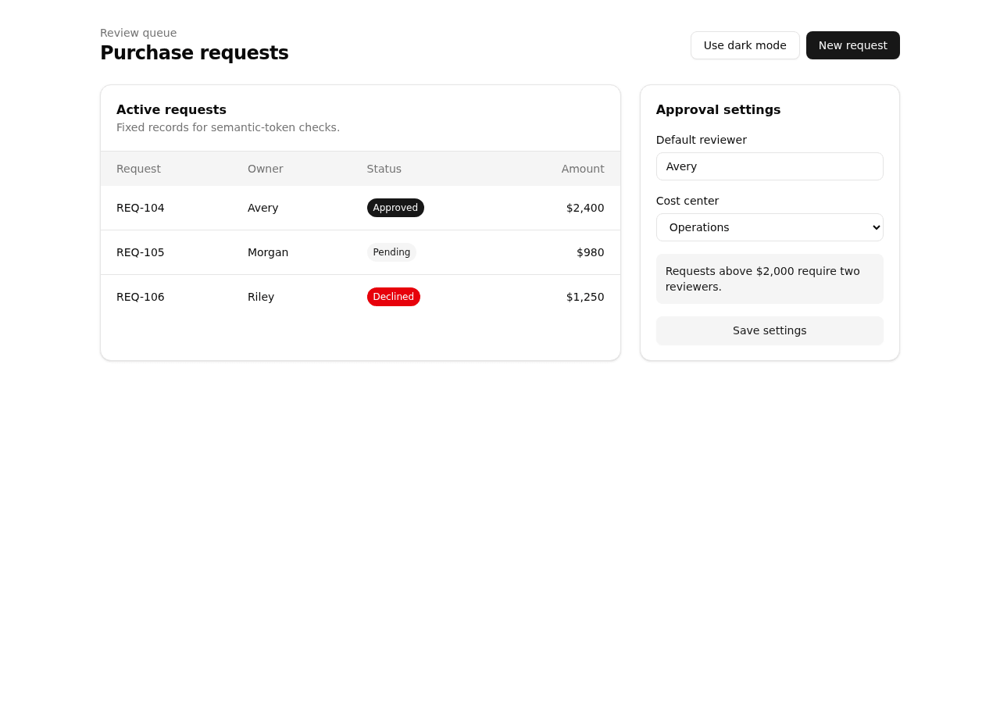
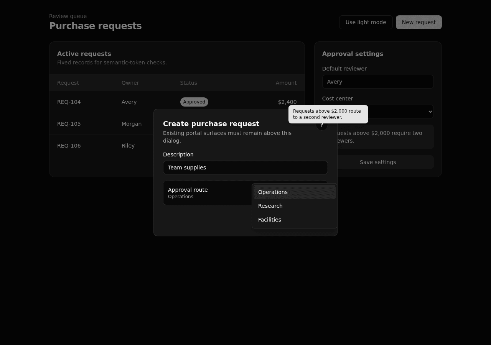

# Consumer fixture gallery

These deterministic apps model a plain Tailwind v4 control and an established shadcn-style app. The screenshots document their production builds; they are not golden tests.

| Plain Tailwind control                                                                                                                | Established shadcn-style app                                                                                                                                  |
| ------------------------------------------------------------------------------------------------------------------------------------- | ------------------------------------------------------------------------------------------------------------------------------------------------------------- |
|                                                       |                                                     |
| A minimal Tailwind app that catches setup steps that assume an existing semantic theme or change baseline utility and reset behavior. | An app-owned semantic token system that catches token collisions, mode mismatches, and regressions in cards, forms, statuses, tables, and top-layer surfaces. |

## Dark and interaction state

| Established shadcn-style app                                                                                                                |
| ------------------------------------------------------------------------------------------------------------------------------------------- |
|  |
| The portal dialog keeps its independently portaled help tooltip and approval-route menu visibly above the backdrop.                         |

The gallery is capped at 250 KiB per PNG and 300 KiB total.
